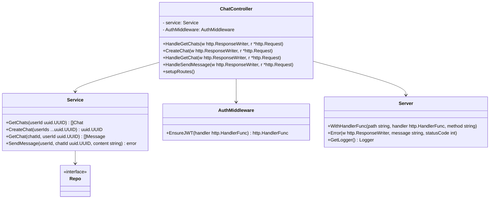

# 📦 ChatController – Dokumentation

## 🧭 Übersicht

Der `ChatController` ist ein HTTP-Controller für den Chat-Service der Anwendung. Er stellt verschiedene REST-Endpoints zur Verfügung, um Chats zu erstellen, abzurufen und Nachrichten zu versenden. Der Controller verwendet JWT-Authentifizierung und basiert auf Gorilla Mux für das Routing.

## 🧩 Abhängigkeiten

* [`github.com/google/uuid`](https://pkg.go.dev/github.com/google/uuid) – zur Arbeit mit UUIDs.
* [`github.com/gorilla/mux`](https://github.com/gorilla/mux) – HTTP-Router.
* Benutzerdefinierte Module:

    * `service` – enthält die Geschäftslogik für Chats.
    * `repo` – Schnittstelle zur Datenbank.
    * `auth` – JWT-Authentifizierung.
    * `server` – generische Server-Initialisierung und Hilfsmethoden.

---

## 🔐 Authentifizierung

Alle Endpunkte sind durch ein JWT geschützt. Der Authentifizierungs-Middleware `EnsureJWT()` überprüft den Token und stellt sicher, dass der Request gültig ist. Die `UserId` wird aus dem HTTP-Header `UserIdHeader` gelesen, der durch die Middleware gesetzt wird.

---

## 📚 API-Endpunkte

### `GET /chat`

**Beschreibung:** Gibt alle Chats des authentifizierten Nutzers zurück.
**Header:** `Authorization: Bearer <JWT>`
**Antwort:** JSON-Liste von `repo.Chat` Objekten.

### `POST /chat`

**Beschreibung:** Erstellt einen neuen Chat mit den angegebenen Benutzer-IDs (inklusive sich selbst).
**Body:**

```json
{
  "userIds": ["<uuid1>", "<uuid2>", ...]
}
```

**Antwort:** ID des neu erstellten Chats als JSON-String.

### `GET /chat/{chatId}`

**Beschreibung:** Gibt alle Nachrichten für einen bestimmten Chat zurück.
**Path-Parameter:** `chatId` (UUID)
**Antwort:** JSON-Liste von `repo.Message` Objekten.

### `POST /chat/{chatId}/messages`

**Beschreibung:** Sendet eine Nachricht in einen bestimmten Chat.
**Path-Parameter:** `chatId` (UUID)
**Body:**

```json
{
  "content": "Hallo Welt!"
}
```

**Antwort:** HTTP 201 Created, keine Body-Antwort.

---

## ⚙️ Funktionsweise im Detail

* **Initialisierung:** Die Funktion `New()` erstellt eine neue `ChatController`-Instanz, registriert alle Routen und initialisiert den Service.
* **Routing:** Wird durch `setupRoutes()` konfiguriert.
* **Fehlerbehandlung:** Einheitlich über die Methode `Error(w, message, code)` aus der eingebetteten Server-Struktur.
* **Logging:** Der Controller nutzt `GetLogger().Debug()` zur Protokollierung von Nachrichten.

---

## 🧪 Fehlerbehandlung

Die API gibt im Fehlerfall strukturierte JSON-Objekte vom Typ `ErrorResponse` zurück:

```json
{
  "message": "Fehlermeldung"
}
```

HTTP-Statuscodes:

* `400 Bad Request`: Ungültige UUIDs, fehlerhaftes JSON etc.
* `500 Internal Server Error`: Fehler aus der Geschäftslogik oder Datenbank.

---

## 🔄 Erweiterbarkeit

Der Controller ist modular aufgebaut:

* Neue Endpunkte können leicht durch weitere Methoden und `WithHandlerFunc`-Registrierungen ergänzt werden.
* `Service`-Schicht kapselt die Geschäftslogik und ist leicht austauschbar/testbar.
* Durch Middleware flexibel erweiterbar (z. B. für Rate-Limiting, Logging, etc.).


