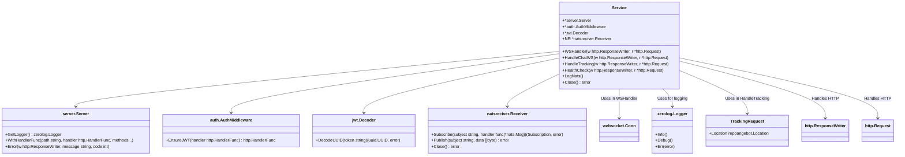

# Gateway Service - Dokumentation

Der Gateway-Service ist ein zentraler HTTP-Proxy, der eingehende Anfragen basierend auf dem URL-Pfad an die jeweils zuständigen Microservices weiterleitet.

---

## Zweck

* Zentrale Anlaufstelle für Clients
* Weiterleitung von HTTP-Anfragen an Microservices
* Einfaches Routing basierend auf URL-Präfixen
* Einheitliche Schnittstelle für mehrere Backend-Services

---

## Routing-Regeln

| URL-Pfad-Präfix | Zielservice                                         | Beschreibung                   |
|-----------------|-----------------------------------------------------| ------------------------------ |
| `api/user/*`    | User-Service (z.B. `http://userservice:8080`)       | Benutzerverwaltung             |
| `api/angebot/*` | Angebot-Service (z.B. `http://angebotservice:8080`) | Angebotsverwaltung             |
| `api/media/*`   | Media-Service (z.B. `http://mediaservice:8080`)     | Medienverwaltung               |
| `/` (andere)    | Frontend oder 404-Fehler                            | Standardseite oder Fehlerseite |

---

## Nutzung als Client

Clients senden alle Anfragen an das Gateway (z.B. `https://localhost/api`). Das Gateway sorgt automatisch dafür, dass die Anfragen beim richtigen Service landen.

---

## Beispiel-Endpunkte (über Gateway)

| HTTP Methode | Pfad             | Zweck                        |
| ------------ |------------------| ---------------------------- |
| GET          | `api/user/`      | Liste aller Benutzer abrufen |
| POST         | `api/user/`      | Neuen Benutzer anlegen       |
| PUT          | `api/user/{id}`  | Benutzer aktualisieren       |
| DELETE       | `api/user/{id}`  | Benutzer löschen             |
| GET          | `api/angebot/`   | Angebote abrufen             |
| GET          | `api/media/{id}` | Mediendatei abrufen          |
| GET          | `/`              | Frontend oder Startseite     |

---

## Vorteile

* **Vereinfachte Client-Integration:** Ein einziger Endpunkt für alle Services
* **Flexibles Routing:** Einfaches Hinzufügen neuer Services und Pfade
* **Zentrale Sicherheitskontrolle:** Authentifizierung, Logging oder Rate-Limiting können hier zentral implementiert werden
* **Entkopplung der Clients von den Backend-Services**

---

## Beispiel Client-Code (JavaScript)

```js
const BASE_URL = "https://localhost";

// Benutzerliste abrufen
async function fetchUsers() {
  const response = await fetch(`${BASE_URL}/users/`);
  if (!response.ok) throw new Error("Fehler beim Abrufen der Benutzer");
  return response.json();
}

// Benutzer erstellen
async function createUser(userData) {
  const response = await fetch(`${BASE_URL}/users/`, {
    method: "POST",
    headers: { "Content-Type": "application/json" },
    body: JSON.stringify(userData),
  });
  if (!response.ok) throw new Error("Fehler beim Erstellen des Benutzers");
  return response.json();
}

// Angebot abrufen
async function fetchAngebote() {
  const response = await fetch(`${BASE_URL}/angebote/`);
  if (!response.ok) throw new Error("Fehler beim Abrufen der Angebote");
  return response.json();
}
```
