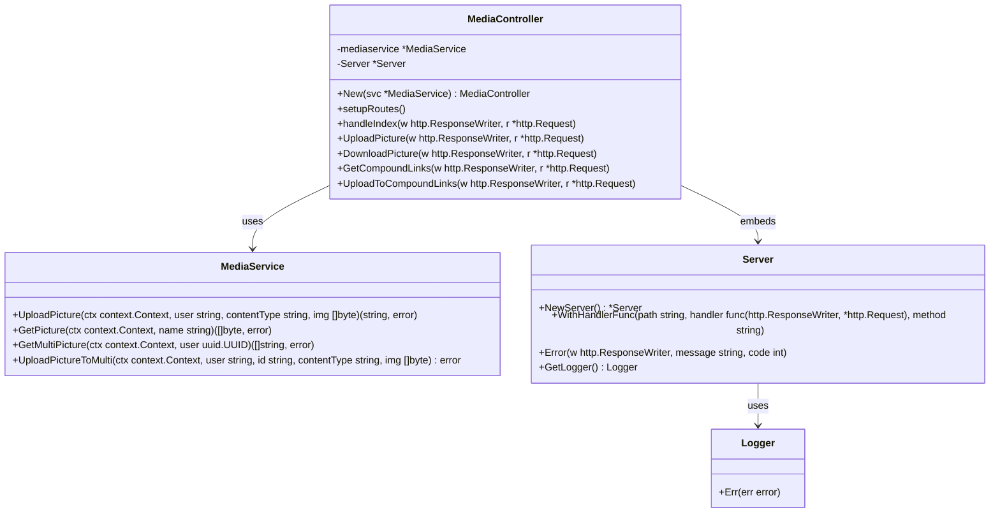

# MediaService Controller

Der MediaService Controller stellt HTTP-Endpunkte bereit, um Bilder und Medieninhalte zu verwalten. Dies umfasst den Upload, Download und das Verwalten mehrerer Bild-Links für Benutzer oder Angebote.

## Übersicht

Der Controller ist Teil des MediaService und bindet sich an die Business-Logik (`service.MediaService`) sowie den HTTP-Server (`server.Server`). Er bietet folgende Funktionalitäten:

* **Upload einzelner Bilder** (z.B. Profilbilder, Banner)
* **Download einzelner Bilder**
* **Verwalten von "Compound Links"**, d.h. mehreren Bildern, die einem Nutzer oder Objekt zugeordnet sind (z.B. mehrere Bilder zu einem Angebot)
* **Healthcheck**

---

## Endpunkte

### GET `/media/image`

* **Beschreibung:** Health-Check Endpoint, gibt „Hello World“ zurück
* **Antwort:** 200 OK, Text „Hello World“

---

### POST `/media/image`

* **Beschreibung:** Upload eines einzelnen Bildes für den authentifizierten Benutzer
* **Headers:**

  * `Authorization` (JWT Token, Pflicht)
  * `Content-Type` (z.B. `image/jpeg`, Pflicht)
  * `UserId` (User-ID im Header)
* **Body:** Bilddaten (rohe Bytes)
* **Antwort:**

  * 200 OK mit JSON `{ "name": "<Bildname>", "success": true }`
  * Fehlercodes: 400 (Bad Request), 500 (Serverfehler)

---

### GET `/media/image/{id}`

* **Beschreibung:** Download eines Bildes anhand des Namens/IDs
* **Parameter:**

  * `id` (Pfadparameter, Bildname)
* **Antwort:**

  * 200 OK mit Bilddaten (`image/jpeg`)
  * Fehlercodes: 400, 500

---

### GET `/media/multi/{id}`

* **Beschreibung:** Gibt eine Liste von URLs zurück, die zu mehreren Bildern (Compound Links) eines Nutzers gehören
* **Parameter:**

  * `id` (Pfadparameter, User UUID)
* **Antwort:**

  * 200 OK mit JSON-Array von Bild-URLs
  * Fehlercodes: 400, 500

---

### POST `/media/multi/{id}`

* **Beschreibung:** Upload eines Bildes, das mit Compound Links für einen bestimmten User/Offer verknüpft wird
* **Headers:**

  * `Authorization` (JWT Token)
  * `Content-Type` (z.B. `image/jpeg`)
  * `UserId` (User-ID im Header)
* **Parameter:**

  * `id` (Pfadparameter, Compound Link ID)
* **Body:** Bilddaten (rohe Bytes)
* **Antwort:** 200 OK bei Erfolg
* **Fehlercodes:** 400, 500

---

## Implementierungsdetails

* Nutzt `github.com/gorilla/mux` für Routing.
* Setzt voraus, dass der User über den `UserIdHeader` im HTTP Header identifiziert wird.
* Nutzt den MediaService (`service.MediaService`) für alle Business-Logik Operationen (Upload, Download, Verwaltung von Compound Links).
* Fehler werden als JSON mit `{ "message": "Fehlermeldung" }` zurückgegeben.
* Unterstützt Multipart-Bild-Uploads nicht (rohe Bytes im Request Body).

---

## Beispiel-Request Upload Bild

```bash
curl -X POST "http://localhost:8080/media/image" \
     -H "Authorization: Bearer <jwt-token>" \
     -H "UserId: <user-uuid>" \
     -H "Content-Type: image/jpeg" \
     --data-binary "@meinbild.jpg"
```

---

## Fehlerbehandlung

Der Controller gibt bei Fehlern aussagekräftige HTTP-Statuscodes zurück:

| Statuscode | Bedeutung                                                            |
| ---------- | -------------------------------------------------------------------- |
| 400        | Ungültige Anfrage (z.B. fehlende Parameter, fehlerhafte UUID)        |
| 500        | Interner Serverfehler (z.B. Probleme beim Zugriff auf Medienservice) |

---

