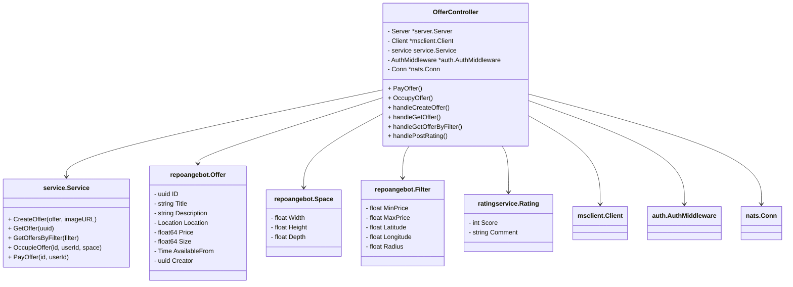

# 📦 Angebotservice

Der `angebotservice` stellt REST-HTTP-Endpunkte zur Verwaltung von Angeboten bereit. Dazu gehören das Erstellen, Abrufen, Buchen, Bezahlen und Bewerten von Angeboten. Die Authentifizierung erfolgt per JWT, und die Bewertung wird asynchron über NATS verarbeitet.

---

## 🧰 Features

* 🔐 Authentifizierte Angebots-Erstellung
* 🔎 Filterbare Angebotssuche
* 💬 Bewertungen über NATS Messaging
* 💳 Angebotsbuchung & Bezahlung
* 🖼️ Bild-URL-Generierung über Medienservice
* ✅ Swagger-kompatible API-Dokumentation

---

## 🚀 Quickstart

### Voraussetzungen

* Go 1.20+
* NATS Server (erreichbar über Umgebungsvariable `NATS_URL`)
* Auth-Secret (für JWT-Middleware)

### Beispiel: Initialisierung

```go
svc := service.NewOfferService(repo, mediaClient)
secret := []byte("dein_geheimes_jwt_secret")
controller := angebotservice.New(svc, secret)

http.ListenAndServe(":8080", controller.Router)
```

---

## 🔁 HTTP-Endpunkte

| Methode | Pfad                   | Beschreibung                 | Authentifizierung |
| ------- | ---------------------- | ---------------------------- | ----------------- |
| `POST`  | `/angebot/filter`      | Angebote nach Filter abrufen | ❌                 |
| `POST`  | `/angebot`             | Neues Angebot erstellen      | ✅                 |
| `GET`   | `/angebot/{id}`        | Angebot nach ID abrufen      | ❌                 |
| `POST`  | `/angebot/{id}/occupy` | Angebot buchen               | ✅                 |
| `POST`  | `/angebot/{id}/pay`    | Angebot bezahlen             | ✅                 |
| `POST`  | `/angebot/{id}/rating` | Angebot bewerten (via NATS)  | ✅                 |

---

## 🔐 Authentifizierung

* JWT wird über den HTTP-Header `Authorization: Bearer <token>` mitgesendet.
* Der Token muss die `UserId` enthalten, welche vom `auth.AuthMiddleware` ausgelesen und als Header `UserId` weitergereicht wird.

---

## 🧾 Beispieldatenstrukturen

### 🎯 Angebotsstruktur (`repoangebot.Offer`)

```json
{
  "title": "Tiefgaragenstellplatz",
  "description": "Mit direktem Zugang zum Aufzug.",
  "location": {
    "latitude": 48.137,
    "longitude": 11.575
  },
  "price": 50,
  "size": 12,
  "availableFrom": "2025-07-01"
}
```

### 📥 Bewertung (`ratingservice.Rating`)

```json
{
  "score": 5,
  "comment": "Super Angebot!"
}
```

---

## 💬 NATS Messaging

* Bewertungen werden nicht synchron in die Datenbank geschrieben.
* Stattdessen werden sie über NATS veröffentlicht:

```go
c.Publish("rating.{userID}", body)
```

---

## 🐞 Fehlerbehandlung

Antworten im Fehlerfall sind konsistent aufgebaut:

```json
{
  "message": "Fehlerbeschreibung"
}
```

Beispiele für Statuscodes:

* `400 Bad Request` – z. B. bei fehlerhafter UUID
* `401 Unauthorized` – fehlende oder ungültige JWT
* `500 Internal Server Error` – unerwartete Fehler

---

## 📚 Abhängigkeiten

* [Gorilla Mux](https://github.com/gorilla/mux) – Routing
* [Google UUID](https://github.com/google/uuid)
* [NATS Go Client](https://github.com/nats-io/nats.go)
* Eigene Module:

   * `auth`
   * `server`
   * `ratingservice`
   * `mediaservice/msclient`
   * `angebotservice/service/repo_angebot`

