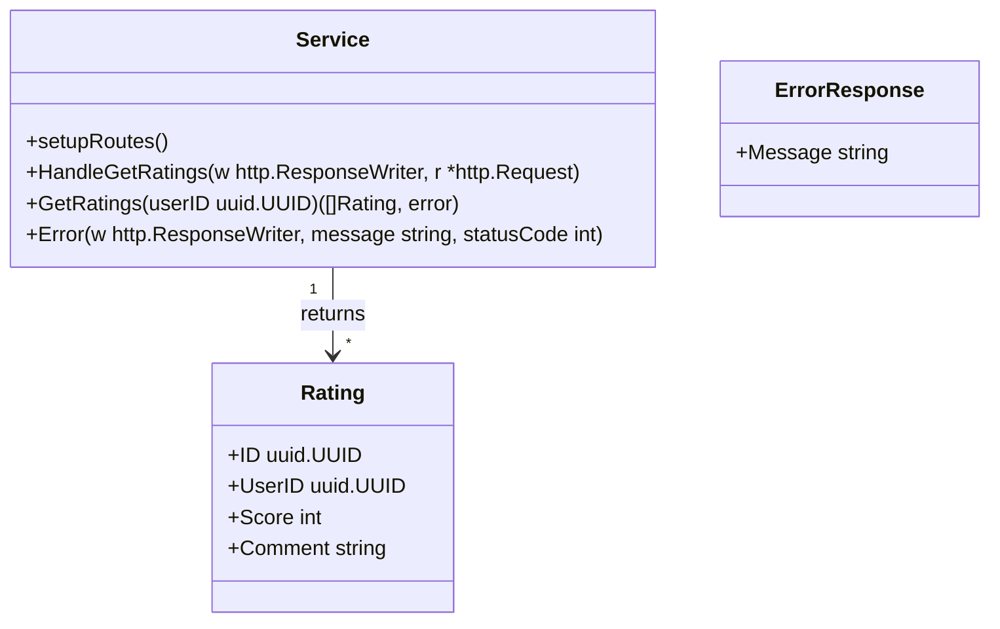

# Rating Service API

Der Rating Service stellt eine HTTP-API zur Verfügung, um Bewertungen (Ratings) für Benutzer abzurufen.

## Endpunkt: GET /ratings/{user}

### Beschreibung

Ruft alle Bewertungen für einen bestimmten Benutzer ab.

### Pfadparameter

| Name | Typ    | Pflicht | Beschreibung                                                 |
| ---- | ------ | ------- | ------------------------------------------------------------ |
| user | string | ja      | UUID des Benutzers, für den die Bewertungen abgefragt werden |

### Anfrage

* Methode: `GET`
* URL: `/ratings/{user}`
* Header:

    * `Accept: application/json`

### Antwort

* Erfolgsfall (`200 OK`):
  Ein JSON-Array mit den Bewertungen des angegebenen Benutzers.
  Beispiel:

  ```json
  [
    {
      "id": "uuid",
      "userID": "uuid",
      "score": 5,
      "comment": "Great service!"
    },
    ...
  ]
  ```

* Fehlerfälle:

    * `400 Bad Request`: Wenn die übergebene Benutzer-ID keine gültige UUID ist.
      Beispiel:

      ```json
      {
        "message": "invalid UUID format"
      }
      ```

    * `500 Internal Server Error`: Wenn ein unerwarteter Fehler beim Abrufen der Bewertungen auftritt.
      Beispiel:

      ```json
      {
        "message": "database error"
      }
      ```

### Hinweise

* Die Benutzer-ID muss im UUID-Format vorliegen.
* Die Methode `GetRatings(userID uuid.UUID)` wird verwendet, um die Bewertungen aus der Datenquelle zu holen.
* Die Response enthält den Content-Type Header `application/json`.

