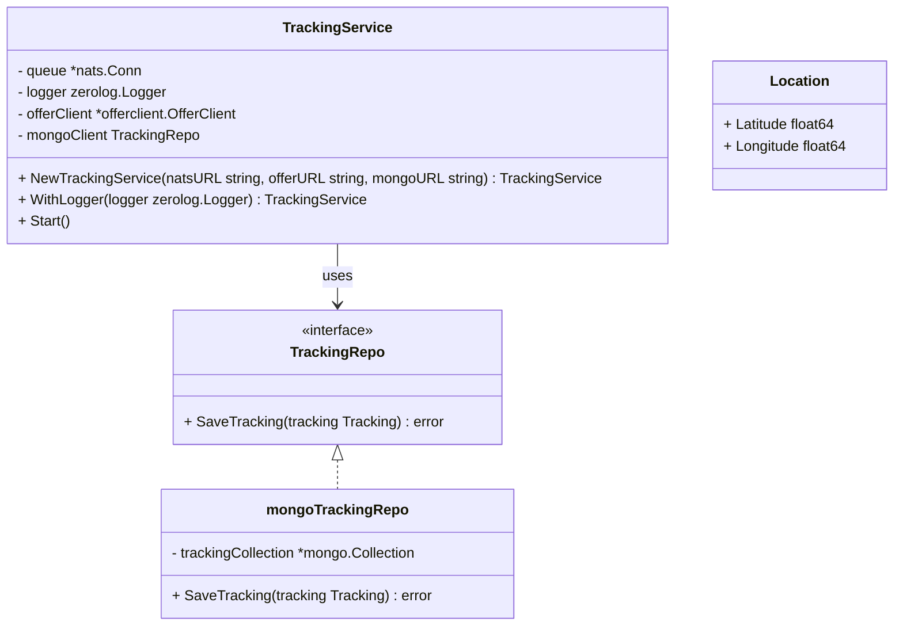

# Tracking Service Dokumentation

## Überblick

Der Tracking Service ist verantwortlich für das Erfassen, Speichern und Weiterleiten von Tracking-Daten der Benutzer. Er empfängt Tracking-Informationen über eine NATS-Messaging-Queue, speichert diese in einer MongoDB-Datenbank und veröffentlicht Tracking-Daten an verbundene Nutzer basierend auf verfügbaren Angeboten.

---

## Komponenten

### 1. Repository (package `repo`)

#### `mongoTrackingRepo`

* Verwaltet die MongoDB-Verbindung und die Sammlung (`tracking`).
* Verbindet sich mit der MongoDB über die URI beim Erstellen (`NewMongoTrackingRepo`).
* Speichert Tracking-Daten mit `SaveTracking(tracking Tracking) error` in die MongoDB.

#### `Tracking` (Struct)

* Repräsentiert ein Tracking-Dokument, das gespeichert wird.
* Felder:

    * `UserID` (UUID): Die ID des Benutzers, zu dem das Tracking gehört.
    * `Tracking` (gateway.TrackingRequest): Das eigentliche Tracking-Objekt, das Standort- und weitere Tracking-Daten enthält.

#### `TrackingRepo` (Interface)

* Definiert die Methode `SaveTracking(Tracking) error`, um Tracking-Daten zu speichern.

---

### 2. TrackingService (package `trackingservice`)

#### Struktur

* `queue` (\*nats.Conn): Verbindung zur NATS-Messaging-Queue.
* `logger` (zerolog.Logger): Logger für Ereignisse und Fehler.
* `offerClient` (\*offerclient.OfferClient): Client zum Abrufen von Angeboten.
* `mongoClient` (repo.TrackingRepo): Repository zum Speichern der Tracking-Daten in MongoDB.

#### Konstruktor

```go
func NewTrackingService(natsURL string, offerURL string, mongoURL string) *TrackingService
```

* Initialisiert alle notwendigen Komponenten (NATS-Verbindung, Logger, OfferClient, MongoDB Repository).
* Verbindet sich mit NATS, Offer-Service und MongoDB.

#### Methoden

* `WithLogger(logger zerolog.Logger) *TrackingService`: Ermöglicht das Setzen eines benutzerdefinierten Loggers.
* `Start()`: Startet den Service und abonniert Tracking-Nachrichten auf dem NATS-Subject `tracking.user.*`.

---

## Funktionsweise (`Start` Methode)

1. Abonnement auf NATS Topic `tracking.user.*`, wobei `*` die UserID ist.
2. Empfangene Nachrichten werden verarbeitet:

    * Extrahieren der UserID aus dem Topic.
    * Abrufen der relevanten Angebote für diesen User über den `offerClient`.
    * Wenn keine Angebote gefunden wurden, wird die Nachricht verworfen.
    * Deserialisierung der Tracking-Daten (`TrackingRequest`).
    * Speicherung der Tracking-Daten in MongoDB.
    * Weiterleitung der Tracking-Daten an alle Benutzer, die im `OccupiedSpace` des Angebots enthalten sind.
3. Fehler beim Parsen, Abrufen, Speichern oder Veröffentlichen werden geloggt.

---

## Abhängigkeiten

* MongoDB (Datenbank für Tracking-Daten).
* NATS (Messaging-System für Event-basierte Kommunikation).
* `offerclient` (Client zur Kommunikation mit dem Angebot-Service).
* `zerolog` (Logging-Framework).
* UUID (Identifikation von Benutzern).
* `gateway.TrackingRequest` (Datenmodell für Tracking-Daten).

---

## Beispiel für Tracking-Daten (gateway.TrackingRequest)

```json
{
  "location": {
    "latitude": 52.5200,
    "longitude": 13.4050
  },
  "timestamp": "2025-06-27T12:00:00Z"
}
```

---

## Fehlerbehandlung

* Verbindungsfehler zu NATS oder MongoDB führen zu einem `panic` bei Initialisierung.
* Laufzeitfehler beim Verarbeiten von Nachrichten werden geloggt, der Service läuft jedoch weiter.
* Keine Angebote für einen User führen zu einer Info-Logmeldung.

