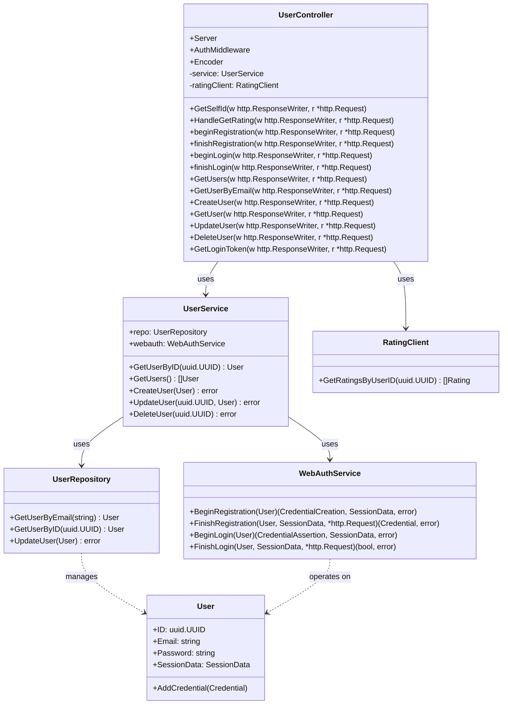

# Dokumentation zum Package `userservice`

## Überblick

Das Package `userservice` implementiert einen HTTP-Controller zur Verwaltung von Benutzerkonten in einem Backend-System. Es bietet REST-API-Endpunkte für Benutzeroperationen wie Erstellen, Lesen, Aktualisieren, Löschen (CRUD), Authentifizierung via JWT und WebAuthn sowie Integration mit einem externen Bewertungssystem.

---

## Hauptkomponenten

### UserController

`UserController` ist die zentrale Komponente, die HTTP-Anfragen entgegennimmt, verarbeitet und die Benutzerlogik koordiniert.

* **Felder:**

    * `Server` — HTTP-Server-Basis.
    * `AuthMiddleware` — Middleware zur JWT-Authentifizierung.
    * `Encoder` — JWT-Encoder zum Erstellen von Tokens.
    * `service` — Business-Logik-Service für Benutzeroperationen.
    * `ratingClient` — Client für den Zugriff auf externe Benutzerratings.

* **Konstruktor:**

    * `New(svc *UserService, secret []byte) *UserController`

        * Initialisiert den Controller, lädt Umgebungsvariablen (z.B. `RATING_SERVICE_URL`), richtet Middleware ein und konfiguriert die API-Routen.

---

## API-Endpunkte und Funktionalitäten

### Benutzer-Endpoints

* `GET /self`

    * Gibt die User-ID des aktuell authentifizierten Benutzers zurück.
    * Authentifizierung via JWT erforderlich.

* `GET /users`

    * Liefert eine Liste aller Benutzer.

* `GET /users/{id}`

    * Liefert Details eines Benutzers anhand der UUID (Passwort wird nicht zurückgegeben).

* `GET /users/email?email=...`

    * Liefert einen Benutzer anhand der E-Mail-Adresse.

* `POST /users`

    * Erstellt einen neuen Benutzer mit den übergebenen JSON-Daten.

* `PUT /users/{id}`

    * Aktualisiert den Benutzer mit der angegebenen ID. Authentifizierung via JWT erforderlich.

* `DELETE /users/{id}`

    * Löscht den Benutzer mit der angegebenen ID. Authentifizierung via JWT erforderlich.

---

### Authentifizierungsendpunkte

* `POST /users/login`

    * Authentifiziert einen Benutzer anhand von E-Mail und Passwort.
    * Gibt bei Erfolg ein JWT zurück, gültig für 24 Stunden.

* **WebAuthn Registrierung & Login**

    * `GET /users/webauthn/register/options`

        * Beginnt die WebAuthn-Registrierung (liefert Registrierungsoptionen).
        * Authentifizierung via JWT erforderlich.

    * `POST /users/webauthn/register`

        * Schließt die WebAuthn-Registrierung ab.
        * Authentifizierung via JWT erforderlich.

    * `GET /users/webauthn/login/options?email=...`

        * Beginnt die WebAuthn-Login-Prozedur (liefert Loginoptionen).

    * `POST /users/webauthn/login?email=...`

        * Schließt den WebAuthn-Login ab und gibt ein JWT zurück.

---

### Externe Bewertung

* `GET /users/{id}/rating`

    * Ruft Bewertungen des Benutzers vom externen Rating-Service ab.

---

## Fehlerbehandlung

Fehler werden meist als JSON-Antwort mit einer `ErrorResponse` zurückgegeben, die eine Fehlermeldung (`Message`) enthält. Statuscodes wie 400 (Bad Request), 401 (Unauthorized), 404 (Not Found) und 500 (Internal Server Error) werden entsprechend gesetzt.

---

## Middleware und CORS

Der Controller setzt CORS-Header dynamisch basierend auf dem Origin der Anfrage. Zudem schützt er kritische Endpunkte mit JWT-Authentifizierung mittels Middleware.

---

## Beispiel für eine typische Benutzeranfrage

1. Ein Client sendet eine POST-Anfrage an `/users/login` mit E-Mail und Passwort.
2. Der Controller validiert die Eingaben, überprüft das Passwort und generiert ein JWT.
3. Dieses JWT wird vom Client gespeichert und für zukünftige autorisierte Anfragen im Authorization-Header mitgeschickt.
4. Bei Zugriff auf geschützte Endpunkte wird das Token validiert, und die angeforderte Operation ausgeführt.
